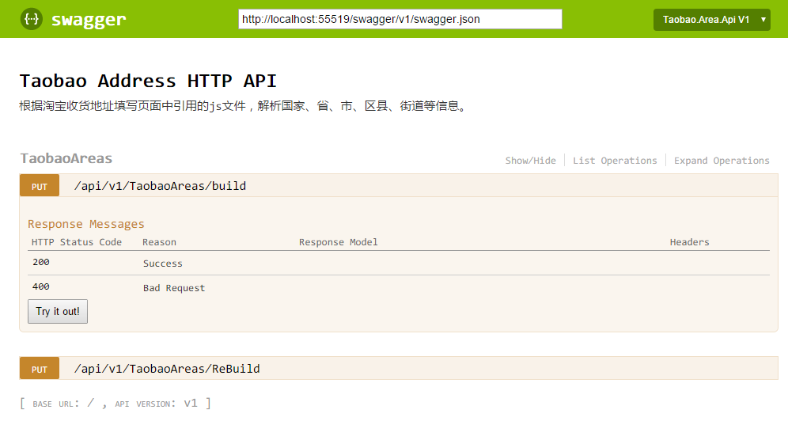
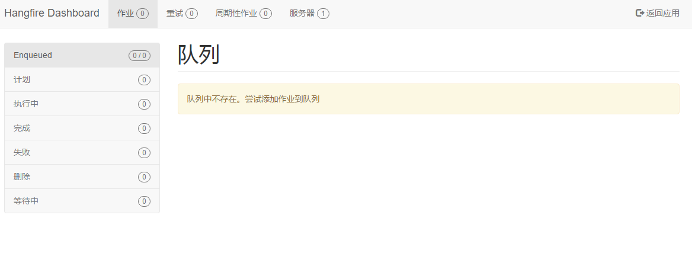
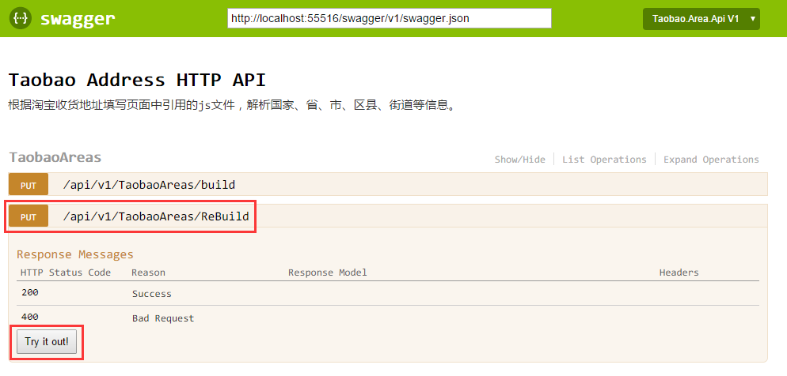
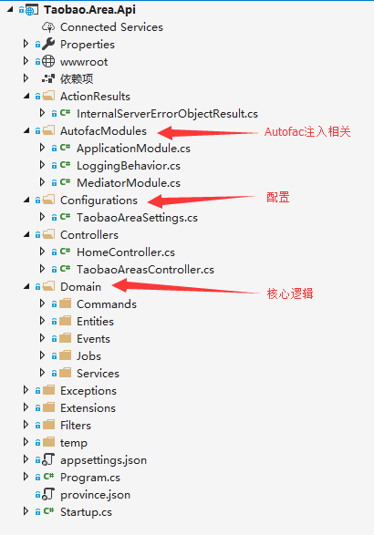
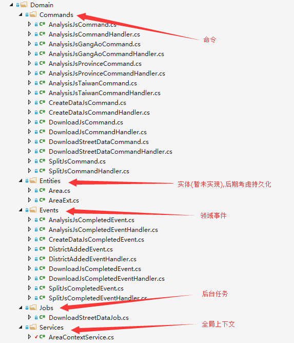
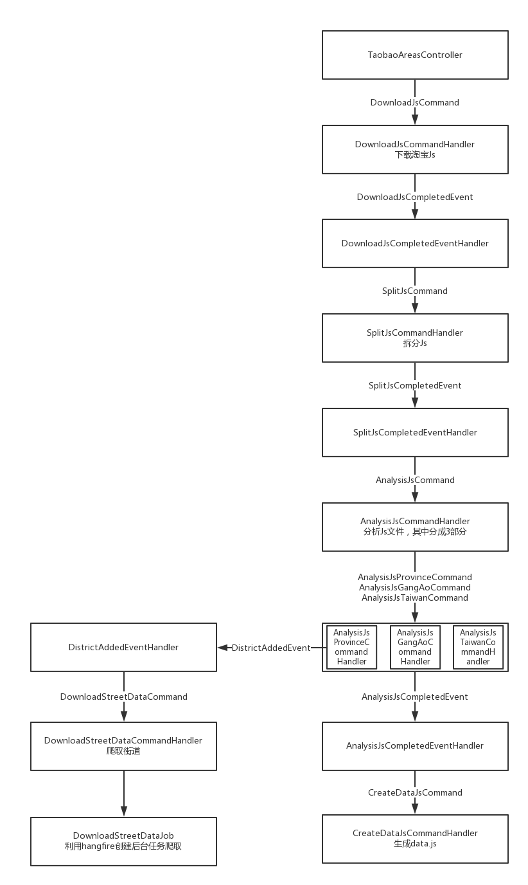

# Escrapado de direcciones de Taobao y visualización en UI
Obtención de datos de país, provincia, ciudad, distrito y calle de Taobao

> Se basa parcialmente en el código de [foxiswho](https://github.com/foxiswho) para [taobao-area-php](https://github.com/foxiswho/taobao-area-php), refactorizado a C#.

Bibliotecas utilizadas:

> - Autofac 
> - MediatR 
> - Swagger 
> - HangFire para generar las tareas de escrapado de datos de calles.

## Demostración

[https://akinix.github.io/Taobao-Area-CSharp/index.html](https://akinix.github.io/Taobao-Area-CSharp/index.html)


El código fuente del frontend se subirá más adelante. Siga a [**deepfunc**](https://github.com/deepfunc)

## Publicaciones

La publicación generada incluye el archivo `省市区县.js` y `街道.json`.

[**Enlace de descarga**](https://github.com/akinix/Taobao-Area-CSharp/releases)

## Objetivo

Para facilitar la obtención de datos relacionados con provincias, ciudades, distritos y calles de China continental y las regiones de Hong Kong, Macao y Taiwán, se analizan y generan los datos correspondientes basándose en el [archivo JS de direcciones de Taobao](https://g.alicdn.com/vip/address/6.0.14/index-min.js).

## Configuración

Toda la configuración se encuentra en `appsettings.json`

|                      | Descripción                                      | Valor predeterminado                                      |
| -------------------- | --------------------------------------- | ---------------------------------------- |
| TaobaoJsVersion      | Versión del JS de Taobao, para facilitar su modificación tras una actualización.                     | 6.0.14                                   |
| TaobaoAreaJsUrl      | El valor predeterminado contiene un marcador de posición que se sustituirá por el valor de `TaobaoJsVersion`.          | https://g.alicdn.com/vip/address/{0}/index-min.js |
| JsDirectoryName      | Directorio donde se generarán los archivos JS y JSON relacionados.                       | js                                       |
| JsTemplate           | Plantilla para generar el archivo JS.                                 | Ver código                                      |
| AreaPickerDataJsName | Nombre del archivo JS generado. El valor predeterminado contiene un marcador de posición que se sustituirá por `TaobaoJsVersion`. | area.picker.data.{0}.js                  |
| TaobaoStreetUrl      | URL utilizada para escrapear las calles.                              | https://lsp.wuliu.taobao.com/locationservice/addr/output_address_town_array.do?l1={0}&l2={1}&l3={2} |
| TempDirectoryName    | Directorio temporal para descargar el JS de Taobao.                            | temp                                     |

## Uso

1. Clone o descargue el código y abra la solución.

2. Presione `F5` o `Ctrl+F5` para depurar el código.

3. Acceda a [http://localhost:55516/](http://localhost:55516/). Por defecto, se abrirá la página de Swagger.

   

4. Abra una nueva pestaña y acceda al panel de Hangfire en [http://localhost:55516/hangfire/jobs/enqueued](http://localhost:55516/hangfire/jobs/enqueued) para ver el estado de ejecución de las tareas de escrapado de calles.

   

5. Para ejecutar la demostración completa, en la página de Swagger, llame a `/api/v1/TaobaoAreas/ReBuild`; esta lógica volverá a descargar el JS y a escrapear la información de las calles. Si llama a `/api/v1/TaobaoAreas/Build`, descargará el JS solo si no existe y escrapeará los datos solo si el JSON no está presente.

   

## Notas de diseño

### Resumen



Descripción de la lógica principal:



### Detalles

1. El proyecto se basa en ASP.NET Core y utiliza varios paquetes principales:

   >**Autofac.Extensions.DependencyInjection**: Reemplaza el contenedor IoC predeterminado de .NET Core.
   >
   >**MediatR**: Para desacoplar la lógica de negocios.
   >
   >**Swashbuckle.AspNetCore**: Genera la documentación de la API para pruebas.
   >
   >**HangFire**: Tareas en segundo plano para manejar la lógica de escrapado de calles.
   >
   >**Hangfire.MemoryStorage**: Almacena las tareas de Hangfire únicamente en memoria.


2. El código de configuración en `TaobaoAreaSettings.cs` es el siguiente:

   ```c#
       public class TaobaoAreaSettings
       {
           public string TempDirectoryName { get; set; }

           public string TaobaoJsVersion { get; set; }
           
           public string TaobaoAreaJsUrl { get; set; }

           public string JsTemplate { get; set; }

           public string AreaPickerDataJsName { get; set; }

           public string TaobaoStreetUrl { get; set; }

           public string JsDirectoryName { get; set; }
       }
   ```

   Para una descripción detallada, consulte la sección **Configuración** anterior.

3. El contexto `AreaContextService`, fragmento de código a continuación. Consulte el código fuente en GitHub para más detalles:

   Esta clase se inyecta con `InstancePerLifetimeScope`, por lo que se crea un nuevo objeto por cada solicitud. Consulte `AutofacModules\ApplicationModule.cs` para ver el código de inyección relevante:

   ```c#
   builder.Register(c => new AreaContextService())
                   .As<AreaContextService>()
                   .InstancePerLifetimeScope();
   ```

   Internamente, gestiona principalmente los datos necesarios durante la ejecución de toda la lógica:

   ```c#
   public bool IsForce { get; private set; } // 是否强制重新生成js及重新爬取街道数据

   public Dictionary<string, object> MainDictionary { get; set; } // 主数据字典:最终生成js时需要的数据

   public string ProvinceString { get; private set; }
   public string GangAoString { get; private set; }
   //... 拆分所需字段
   ```


4. Inyección de servicios asociados a MediatR:

   ```c#
   builder.RegisterAssemblyTypes(typeof(IMediator).GetTypeInfo().Assembly)
       .AsImplementedInterfaces();

   // 注入IRequestHandler和INotificationHandler的相关实现
   // Send -> RequestHandler
   // Publish -> NotificationHandler
   var mediatrOpenTypes = new[]
   {
       typeof(IRequestHandler<,>),
       typeof(IRequestHandler<>),
       typeof(INotificationHandler<>),
   };

   foreach (var mediatrOpenType in mediatrOpenTypes)
   {
       builder
           .RegisterAssemblyTypes(typeof(MediatorModule).GetTypeInfo().Assembly)
           .AsClosedTypesOf(mediatrOpenType)
           .AsImplementedInterfaces();
   }

   // 参照官网
   builder.Register<SingleInstanceFactory>(context =>
   {
       var componentContext = context.Resolve<IComponentContext>();
       return t => { object o; return componentContext.TryResolve(t, out o) ? o : null; };
   });

   builder.Register<MultiInstanceFactory>(context =>
   {
       var componentContext = context.Resolve<IComponentContext>();

       return t =>
       {
           var resolved = (IEnumerable<object>)componentContext.Resolve(typeof(IEnumerable<>).MakeGenericType(t));
           return resolved;
       };
   });

   builder.RegisterGeneric(typeof(LoggingBehavior<,>)).As(typeof(IPipelineBehavior<,>));

   ```

   


### Descripción del flujo



##
