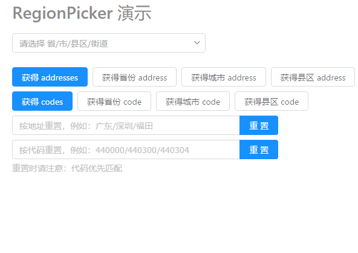
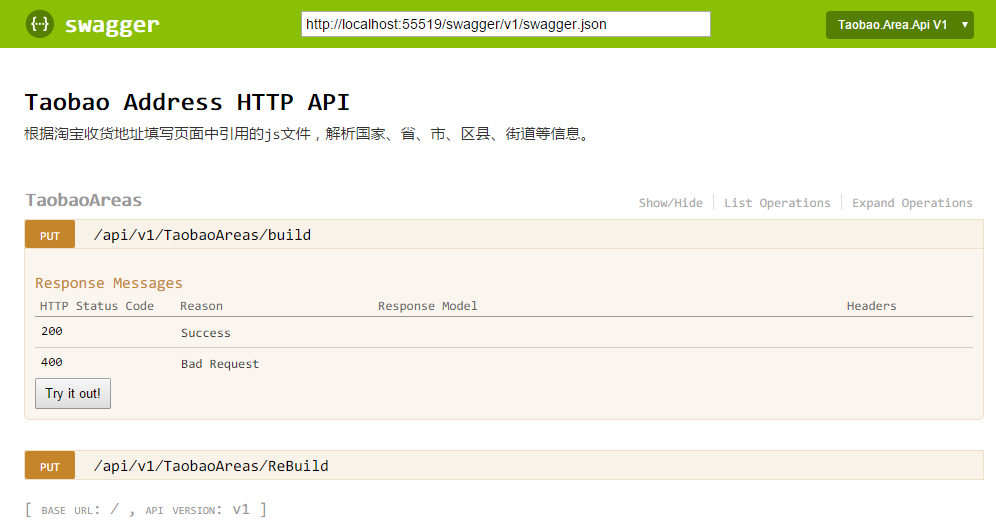
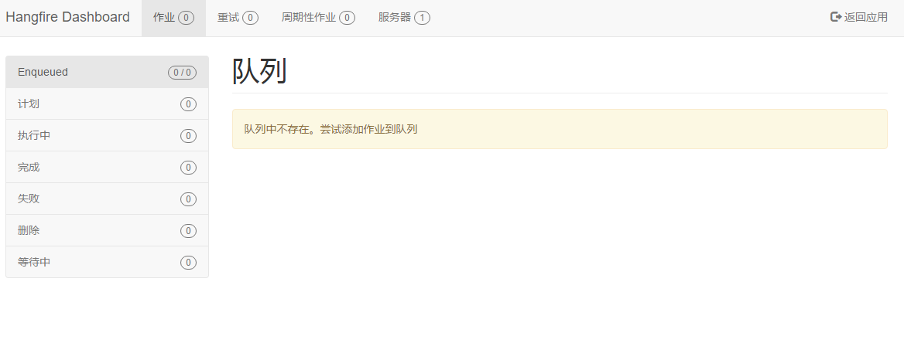
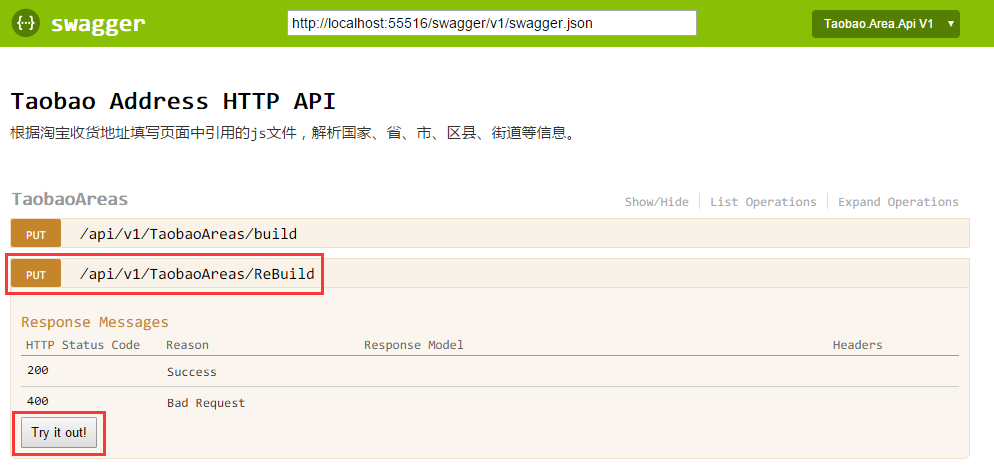
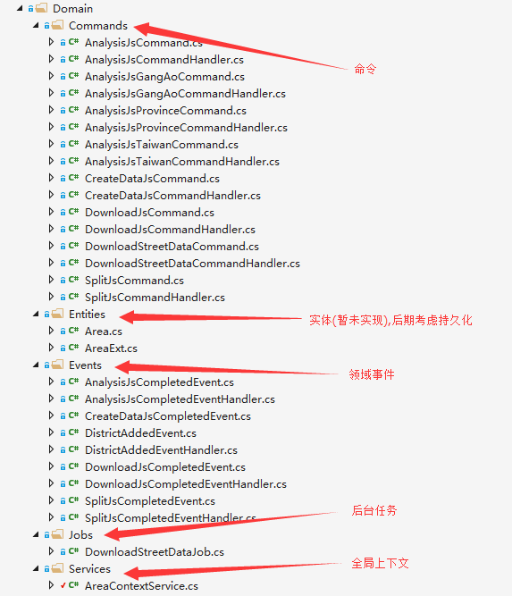
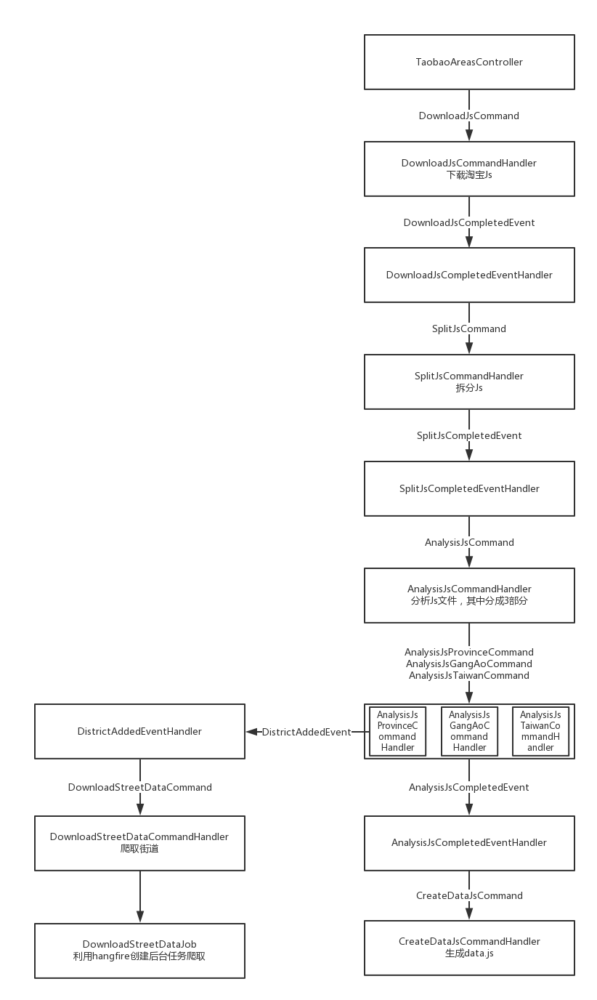

# 淘宝地址爬取及UI展示
淘宝国家省市区街道获取

> 参考 [foxiswho](https://github.com/foxiswho) 的 [taobao-area-php](https://github.com/foxiswho/taobao-area-php) 部分代码，改由c#重构。

引用如下：

> - Autofac 
> - MediatR 
> - Swagger 
> - HangFire 生成街道数据爬取任务。

## 演示

[https://akinix.github.io/Taobao-Area-CSharp/index.html](https://akinix.github.io/Taobao-Area-CSharp/index.html)



前端源码稍后上传,请关注 [**deepfunc**](https://github.com/deepfunc)

## Release

生成的release中包含省市区县.js和街道.json.

[**下载地址**](https://github.com/akinix/Taobao-Area-CSharp/releases)

## 目的

为了方便获取中国大陆及港澳台省市区县街道相关数据，根据 [淘宝地址js](https://g.alicdn.com/vip/address/6.0.14/index-min.js),解析并生成相关数据。

## 设置

所有设置都在 `appsettings.json` 中

|                      | 说明                                      | 默认值                                      |
| -------------------- | --------------------------------------- | ---------------------------------------- |
| TaobaoJsVersion      | 淘宝js的版本，方便淘宝js更新后修改                     | 6.0.14                                   |
| TaobaoAreaJsUrl      | 默认值中有占位符，会替换为TaobaoJsVersion的值          | https://g.alicdn.com/vip/address/{0}/index-min.js |
| JsDirectoryName      | 生成的相关js及json文件的目录                       | js                                       |
| JsTemplate           | 生成的js模版                                 | 见代码                                      |
| AreaPickerDataJsName | 生成的js文件名，默认值中有占位符，会替换为TaobaoJsVersion的值 | area.picker.data.{0}.js                  |
| TaobaoStreetUrl      | 爬取街道使用的url                              | https://lsp.wuliu.taobao.com/locationservice/addr/output_address_town_array.do?l1={0}&l2={1}&l3={2} |
| TempDirectoryName    | 临时目录，下载淘宝js用                            | temp                                     |

## 使用

1. 克隆或下载代码，打开解决方案。

2. `F5` 或 `Ctrl+F5` 调试代码。

3. 访问[http://localhost:55516/](http://localhost:55516/) ,默认会进入Swagger页面。

   

4. 再打开一个新页面,访问Hangfire面板 [http://localhost:55516/hangfire/jobs/enqueued](http://localhost:55516/hangfire/jobs/enqueued), 可以查看爬取街道的任务执行情况.

   

5. 如需演示整个流程，请在Swagger页面，执行 `/api/v1/TaobaoAreas/ReBuild`,该逻辑会重新下载js及重新爬取街道信息;执行`/api/v1/TaobaoAreas/Build`则会根据js是否存在来下载,根据json是否存在来爬取数据.

   

## 设计说明

### 概述


核心逻辑说明:



### 详细

1. 项目基于Asp.net Core,使用了几个核心包:

   >**Autofac.Extensions.DependencyInjection**:替换core的默认Ioc容器.
   >
   >**MediatR**:用于业务逻辑解耦.
   >
   >**Swashbuckle.AspNetCore**:生成Api的文档,供测试.
   >
   >**HangFire**:后台任务,处理爬取街道逻辑.
   >
   >**Hangfire.MemoryStorage**:只使用内存存储Hangfire任务


2. 配置`TaobaoAreaSettings.cs`代码如下:

   ```c#
       public class TaobaoAreaSettings
       {
           public string TempDirectoryName { get; set; }

           public string TaobaoJsVersion { get; set; }
           
           public string TaobaoAreaJsUrl { get; set; }

           public string JsTemplate { get; set; }

           public string AreaPickerDataJsName { get; set; }

           public string TaobaoStreetUrl { get; set; }

           public string JsDirectoryName { get; set; }
       }
   ```

   详细说明参见上面 **设置**

3. 上下文`AreaContextService`,代码片段如下,详情请查看github源码

   该类注入为`InstancePerLifetimeScope`,每次请求会创建一个新对象,注入相关代码查看`AutofacModules\ApplicationModule.cs`

   ```c#
   builder.Register(c => new AreaContextService())
                   .As<AreaContextService>()
                   .InstancePerLifetimeScope();
   ```

   其内部主要维护整个逻辑执行过程中需要的数据

   ```c#
   public bool IsForce { get; private set; } // 是否强制重新生成js及重新爬取街道数据

   public Dictionary<string, object> MainDictionary { get; set; } // 主数据字典:最终生成js时需要的数据

   public string ProvinceString { get; private set; }
   public string GangAoString { get; private set; }
   //... 拆分所需字段
   ```


4. MediatR相关服务注入:

   ```c#
   builder.RegisterAssemblyTypes(typeof(IMediator).GetTypeInfo().Assembly)
       .AsImplementedInterfaces();

   // 注入IRequestHandler和INotificationHandler的相关实现
   // Send -> RequestHandler
   // Publish -> NotificationHandler
   var mediatrOpenTypes = new[]
   {
       typeof(IRequestHandler<,>),
       typeof(IRequestHandler<>),
       typeof(INotificationHandler<>),
   };

   foreach (var mediatrOpenType in mediatrOpenTypes)
   {
       builder
           .RegisterAssemblyTypes(typeof(MediatorModule).GetTypeInfo().Assembly)
           .AsClosedTypesOf(mediatrOpenType)
           .AsImplementedInterfaces();
   }

   // 参照官网
   builder.Register<SingleInstanceFactory>(context =>
   {
       var componentContext = context.Resolve<IComponentContext>();
       return t => { object o; return componentContext.TryResolve(t, out o) ? o : null; };
   });

   builder.Register<MultiInstanceFactory>(context =>
   {
       var componentContext = context.Resolve<IComponentContext>();

       return t =>
       {
           var resolved = (IEnumerable<object>)componentContext.Resolve(typeof(IEnumerable<>).MakeGenericType(t));
           return resolved;
       };
   });

   builder.RegisterGeneric(typeof(LoggingBehavior<,>)).As(typeof(IPipelineBehavior<,>));

   ```

   ​


### 流程说明



## 